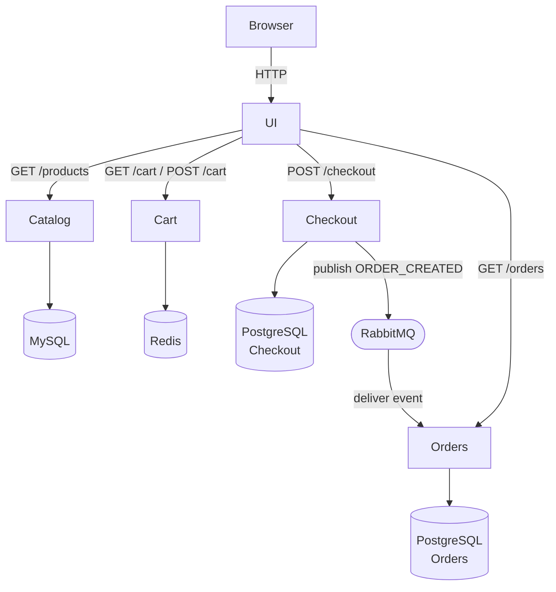

#  GuitarShop — Microservices E-Commerce

A microservices e-commerce application for guitars, amps, and accessories.

Built with **Go, Java, Node.js, MySQL, Redis, PostgreSQL, RabbitMQ, and Docker Compose**.

Runs fully locally with Docker.

---

## Preview 


## Component Diagram
<!-- diagram.png is generated from the Mermaid markup in the next section -->


##  Architecture Diagram


---

## Functionality

- The **UI Service** communicates with backend services using HTTP.
- Each service owns its own database (Database per Service pattern).
- When a customer checks out:
  - Checkout publishes an `ORDER_CREATED` event to RabbitMQ.
  - Orders consumes the event asynchronously.
  - The user gets an instant response while order processing happens in the background.


---

## Tech Stack

| Layer | Technology |
|-------|------------|
| UI | Java 17 + Spring Boot + Thymeleaf |
| Catalog | Go 1.21 |
| Cart | Java 17 + Spring Boot |
| Checkout | Node.js 18 + Express |
| Orders | Java 17 + Spring Boot |
| Catalog DB | MySQL 8 |
| Cart DB | Redis 7 |
| Checkout DB | PostgreSQL 15 |
| Orders DB | PostgreSQL 15 |
| Messaging | RabbitMQ 3.12 |
| Orchestration | Docker + Docker Compose |

---

## Repo Structure

| Folder | Description |
|---|---|
| `microservices/` | Source code for all 5 services |
| `docs/` | Step-by-step documentation — Docker, EKS, Helm, CI/CD |
| `infrastructure/` | Infrastructure as Code (Terraform) |
| `images/` | Architecture diagrams and screenshots |
| `docker-compose.yml` | Run the full stack locally |

---

##  Run Locally

Clone the repository:

```bash
git clone https://github.com/Hepher114/guitar-shop-microservices.git
cd guitar-shop-microservices
```

Start the system:

```bash
docker compose up --build
```

Access:

- Storefront → http://localhost:8080  
- RabbitMQ UI → http://localhost:15672  
  - Username: guitarshop  
  - Password: guitarshop123  

Stop and remove all containers + volumes:

```bash
docker compose down -v
```

---

