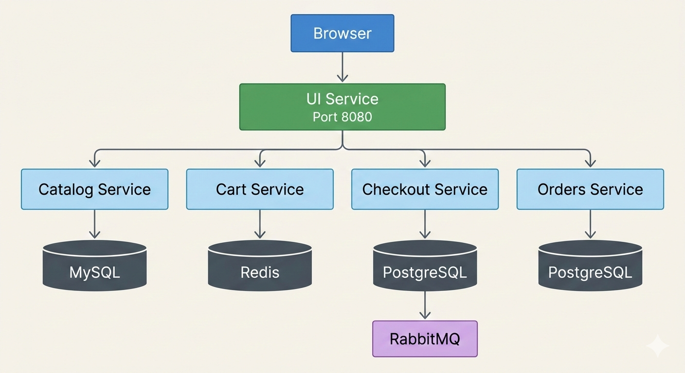

#  GuitarShop — Microservices E-Commerce

A microservices e-commerce application for guitars, amps, and accessories.

Built with **Go, Java, Node.js, MySQL, Redis, PostgreSQL, RabbitMQ, and Docker Compose**.

Runs fully locally with Docker.


---

## Preview 


## Component Diagram


##  Architecture Diagram


---

## Functionality

- The **UI Service** communicates with backend services using HTTP.
- Each service owns its own database (Database per Service pattern).
- When a customer checks out:
  - Checkout publishes an `ORDER_CREATED` event to RabbitMQ.
  - Orders consumes the event asynchronously.
  - The user gets an instant response while order processing happens in the background.


---


## Repo Structure

| Folder | Description |
|---|---|
| `microservices/` | Source code for all 5 services |
| `docs/` | Step-by-step documentation — Docker, EKS, Helm, CI/CD |
| `infrastructure/` | Infrastructure as Code (Terraform) |
| `images/` | Architecture diagrams and screenshots |
| `docker-compose.yml` | Run the full stack locally |
| `article/` | Written series documenting the full build and deployment |

---

## Article Series

| Part | Layer | Topic |
|------|-------|-------|
| 0 | — | [Project Overview](https://github.com/Hepher-Ossounga/guitarShop-depolyment/blob/main/article/1-overview.md) |
| 1 | Dev | [Microservices Architecture — from concept to a real project](https://github.com/Hepher-Ossounga/guitarShop-depolyment/blob/main/article/microsrevices.md) |
| 2 | Dev | [Polyglot Persistence — why each service uses a different database](https://github.com/Hepher-Ossounga/guitarShop-depolyment/blob/main/article/2-polyglot-persistence.md) |
| 3 | DevOps | [Containerizing Polyglot Services — Dockerfiles across Go, Java, and Node.js](https://github.com/Hepher-Ossounga/guitarShop-depolyment/blob/main/article/3-dockerfiles.md) |
| 4 | DevOps | [Docker Compose — running the full stack locally](https://github.com/Hepher-Ossounga/guitarShop-depolyment/blob/main/article/4-docker-compose.md) |
| 5 | DevOps | Deploying to AWS EKS — ECR, cluster setup, Kubernetes manifests |
| 6 | DevOps | Helm — managing configuration and deploying with charts |
| 7 | DevOps | CI/CD — GitHub Actions pipeline from push to production |
| 8 | DevOps | Observability — CloudWatch logging and monitoring |

---

##  Run Locally

Clone the repository:

```bash
git clone https://github.com/Hepher114/guitar-shop-microservices.git
cd guitar-shop-microservices
```

Start the system:

```bash
docker compose up --build
```

Access:

- Storefront → http://localhost:8080  
- RabbitMQ UI → http://localhost:15672  
  - Username: guitarshop  
  - Password: guitarshop123  

Stop and remove all containers + volumes:

```bash
docker compose down -v
```

---

