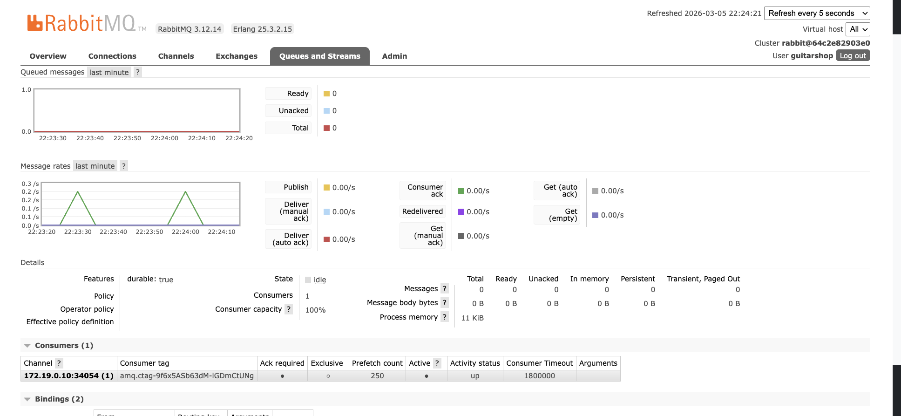
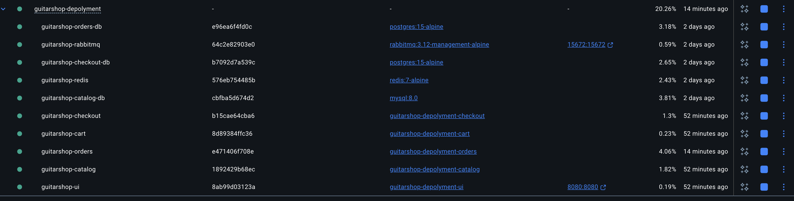

# I Built a Microservices App and Deployed It on AWS — Here's the Full Stack
---

## What This Series Is About

This is a DevOps series. It covers containerizing a real application, pushing images to AWS ECR, deploying to an EKS cluster, managing configuration with Helm, automating the pipeline with GitHub Actions, and wiring up observability with CloudWatch.

To understand the eks deployment, the application has to make sense first — the services, how they communicate, why each one has its own database. That context matters when writing Kubernetes manifests, configuring health checks, or debugging a failing pod.

So this series starts with the application, then moves into the infrastructure.

---

## The Application: GuitarShop

GuitarShop is a fully functional e-commerce store for guitars, amps, and accessories. Browse a catalog, add items to a cart, place an order, check order history. All standard flows, working end to end.


Built as five independent services — not a monolith. Each service has its own codebase, its own database, and its own container. They communicate over HTTP and RabbitMQ.

```
UI Service          → Java 17 + Spring Boot + Thymeleaf
Catalog Service     → Go 1.21
Cart Service        → Java 17 + Spring Boot
Checkout Service    → Node.js 18 + Express
Orders Service      → Java 17 + Spring Boot

Catalog DB          → MySQL 8
Cart DB             → Redis 7
Checkout DB         → PostgreSQL 15
Orders DB           → PostgreSQL 15
Message Broker      → RabbitMQ 3.12
```

10 containers total. 4 languages. 4 databases — each chosen for its workload, not for convenience.

---

## Why This Architecture Matters for DevOps

A monolith is one thing to deploy. A microservices system is ten. That changes everything: how Dockerfiles are written, how Kubernetes manifests are structured, how environment-specific configuration is managed, how rolling updates happen without downtime, and how failures are traced across services.

Each architectural decision in GuitarShop has a direct consequence in the infrastructure layer:

- **Different languages** → different Dockerfiles, different base images, different build steps
- **Database per service** → separate Kubernetes deployments, separate secrets, separate persistent volumes
- **Async messaging with RabbitMQ** → the Orders service scales independently without touching Checkout
- **API gateway (UI Service)** → single ingress point, one LoadBalancer, one external URL

Understanding why the app is structured the way it is makes the infrastructure decisions make sense.

---

## How the Request Flow Works

The browser talks to one service: the UI Service on port 8080. It routes every request to the right backend and assembles the response.


When an order is placed, Checkout saves to its own database, publishes an `ORDER_CREATED` event to RabbitMQ, and returns a confirmation immediately. The Orders service consumes the event in the background — independently, asynchronously, without blocking the checkout response.




---

## The Series

| Part | Layer | Topic |
|------|-------|-------|
| 1 | Dev | [overview](https://github.com/Hepher-Ossounga/guitarShop-depolyment/blob/main/articles/1-overview.md)
| 2 | Dev | [Polyglot persistence — why each service uses a different database](https://github.com/Hepher-Ossounga/guitarShop-depolyment/blob/main/articles/2-polyglot-persistence.md) |
| 3 | DevOps | [Containerizing polyglot services — Dockerfiles across Go, Java, and Node.js](https://github.com/Hepher-Ossounga/guitarShop-depolyment/blob/main/article/3-dockerfiles.md) |
| 4 | DevOps | [Docker Compose — running the full stack locally](https://github.com/Hepher-Ossounga/guitarShop-depolyment/blob/main/article/4-docker-compose.md) |
| 5 | DevOps | Deploying to AWS EKS — ECR, cluster setup, Kubernetes manifests |
| 6 | DevOps | Helm — managing configuration and deploying with charts |
| 7 | DevOps | CI/CD — GitHub Actions pipeline from push to production |
| 8 | DevOps | Observability — CloudWatch logging and monitoring |

The first two parts build the foundation. Everything after that is infrastructure.

---

## Run It Locally

```bash
git clone https://github.com/Hepher114/guitar-shop-microservices.git
cd guitar-shop-microservices
docker compose up --build
```

- Storefront → [http://localhost:8080](http://localhost:8080)
- RabbitMQ UI → [http://localhost:15672](http://localhost:15672) — `guitarshop` / `guitarshop123`

One command starts all 10 containers in the right order, with health checks ensuring each service waits for its dependencies. That local setup is the foundation — the Kubernetes deployment is the same system, running in the cloud.



---

GuitarShop is a working application — ten containers, four languages, four databases, one message broker. The architecture is deliberate: each service owns its data, communicates over defined interfaces, and can be deployed, scaled, or debugged independently.

Part 2 goes deeper on that foundation — four services, four databases, and exactly why each one was chosen. MySQL for the catalog, Redis for the cart, PostgreSQL for checkout and orders. Each decision has a reason, and each reason shows up again in the Kubernetes manifests.