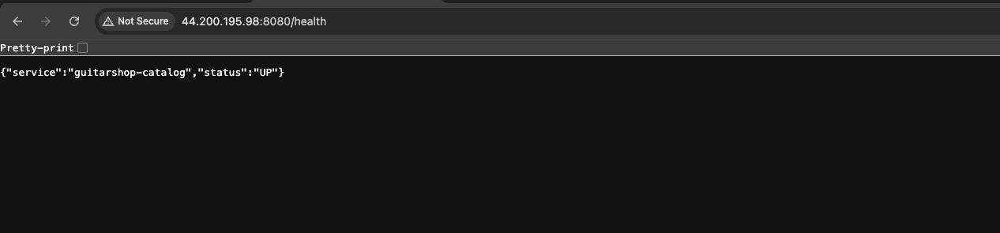

# Catalog Service — Dockerfile Walkthrough & Build

The catalog service is a Go app that serves guitar product data from a MySQL database.
It uses a two-stage Docker build to produce a small, secure final image.

> **Note:** The `docker run` steps in this doc are for **isolated testing** of this service's image on its own — useful for verifying the Dockerfile or debugging the service in isolation. To run the full application, use Docker Compose instead — see [11-docker-compose.md](11-docker-compose.md).

---

## I. Prerequisites

- EC2 instance running
- Docker installed
- Repository cloned

---

## II. Create the Catalog Dockerfile

Navigate to the catalog service directory and create the Dockerfile.

```bash
cd guitarShop-App/catalog
vim Dockerfile
```

Dockerfile:
```dockerfile
# Stage 1 — Build
FROM golang:1.21-alpine AS builder

WORKDIR /app

RUN apk add --no-cache git

COPY go.mod go.sum ./
RUN go mod download

COPY cmd/ ./cmd/
RUN CGO_ENABLED=0 GOOS=linux go build -ldflags="-s -w" -o catalog ./cmd/main.go

# Stage 2 — Runtime
FROM alpine:3.19

WORKDIR /app
RUN addgroup -S guitarshop && adduser -S guitarshop -G guitarshop

COPY --from=builder /app/catalog .
RUN chown guitarshop:guitarshop catalog
USER guitarshop

EXPOSE 8080

ENTRYPOINT ["/app/catalog"]
```

| Stage   | Base Image         | Purpose                              |
|---------|--------------------|--------------------------------------|
| builder | golang:1.21-alpine | Compile Go source into a binary      |
| runtime | alpine:3.19        | Run the binary, nothing else         |

> Key build flags: `CGO_ENABLED=0` disables C bindings (pure Go binary),
> `GOOS=linux` targets Linux, `-ldflags="-s -w"` strips debug info to reduce image size.

> The Dockerfile has no mention of MySQL. The app reads `DB_HOST`, `DB_PORT`,
> `DB_NAME`, `DB_USER`, and `DB_PASSWORD` from environment variables at runtime — directly
> in `cmd/main.go` via a `getEnv()` helper. See [4-catalog-config.md](4-catalog-config.md)
> for how each variable is used.

---

## III. Create a Network

```bash
docker network create guitarshop-test
```

> Containers on the same network can reach each other by name.

---

## IV. Start MySQL

The catalog service uses MySQL because it stores **structured, relational product data** —
guitars, categories, prices, descriptions — that benefits from SQL queries with filtering
and joins. The other services use different databases suited to their own data shape:
cart uses Redis (fast key-value session data), checkout and orders use PostgreSQL
(transactional writes where ACID guarantees matter).

```bash
docker run -d \
  --name test-catalog-db \
  --network guitarshop-test \
  -e MYSQL_ROOT_PASSWORD=rootpassword \
  -e MYSQL_DATABASE=guitarshop_catalog \
  -e MYSQL_USER=guitarshop \
  -e MYSQL_PASSWORD=guitarshop123 \
  mysql:8.0
```

> Wait ~20 seconds for MySQL to finish initializing before running the next step.

---

## V. Build the Catalog Image

```bash
docker build -t guitarshop-catalog-test .
```

> Go builds are fast (~30 seconds). Dependencies are cached after the first build.

---

## VI. Run the Catalog Container

```bash
docker run -d \
  --name test-catalog \
  --network guitarshop-test \
  -p 8080:8080 \
  -e DB_HOST=test-catalog-db \
  -e DB_PORT=3306 \
  -e DB_NAME=guitarshop_catalog \
  -e DB_USER=guitarshop \
  -e DB_PASSWORD=guitarshop123 \
  guitarshop-catalog-test
```

| Flag          | Purpose                                          |
|---------------|--------------------------------------------------|
| `--network`   | Join the same network as MySQL                   |
| `-p 8080:8080`| Expose the app on your host machine              |
| `-e DB_HOST`  | Tell the app where MySQL is (by container name)  |
| `-e DB_PORT`  | MySQL default port                               |
| `-e DB_NAME`  | Database name to connect to                      |
| `-e DB_USER`  | Database user                                    |
| `-e DB_PASSWORD` | Database password                            |

---

## VII. Verify

Replace `<EC2-PUBLIC-IP>` with your EC2 instance's public IP address.

```bash
curl http://<EC2-PUBLIC-IP>:8080/health
```

Expected response:

```json
{"status":"UP","service":"guitarshop-catalog"}
```

---

## VIII. Cleanup

```bash
docker stop test-catalog test-catalog-db
docker rm test-catalog test-catalog-db
docker network rm guitarshop-test
```
